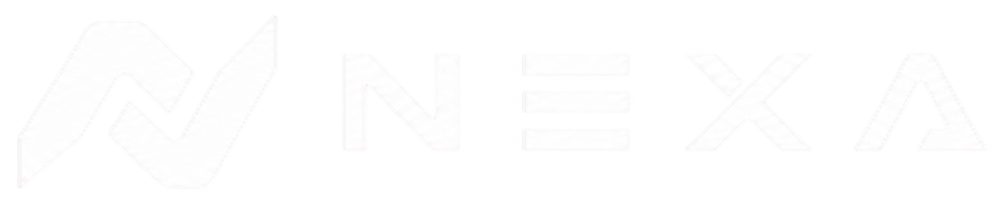
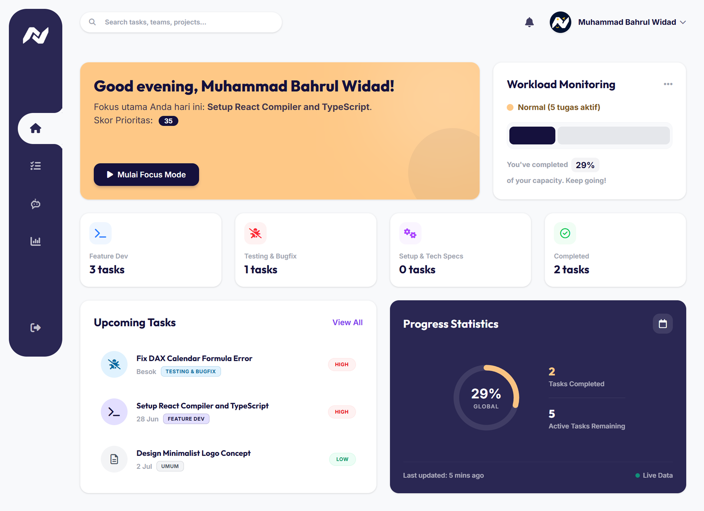
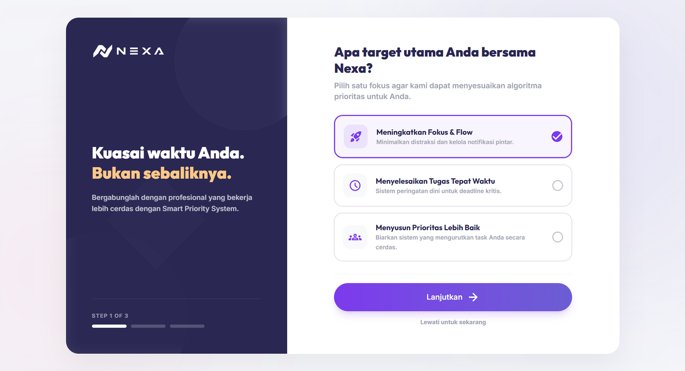
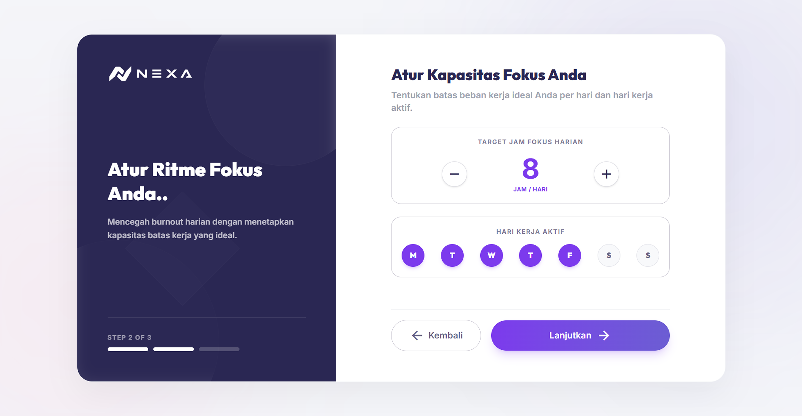
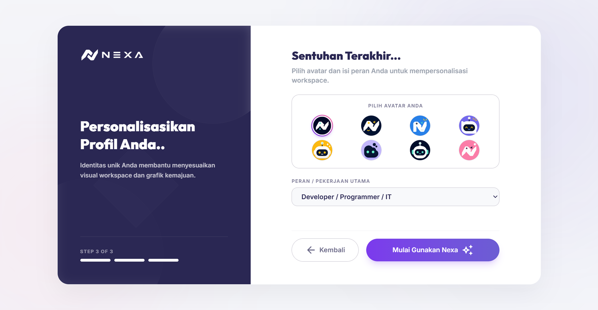

# <p align="center"></p>

<p align="center">
  <strong>⚡ Nexa - Premium Full-Stack Task Management SaaS</strong>
</p>

<p align="center">
  Nexa is a premium <strong>Decision Support System</strong> and task management platform designed to help professionals optimize their daily workflow, manage cognitive load, and prevent burnout.
</p>

<p align="center">
  
  
  
  
  
</p>

---

## ✨ Key Features

* **🎯 Smart Priority Score Engine:** A custom backend algorithm built with Laravel that dynamically calculates task priority based on deadlines, urgency, impact, and duration.
* **⚖️ Workload Monitoring:** Real-time tracking of daily focus hours against user capacity limits to detect and alert before overloading.
* **⏱️ Nexa Focus Hub:** A dedicated, distraction-free execution workspace equipped with a focus countdown timer and post-session progress reflections.
* **🚀 Interactive Split-Screen Onboarding:** A modern, beautiful progressive wizard designed to capture user goals and work capacities during registration.

---

## 📸 Screenshots

<details>
  <summary><b>Lihat Antarmuka Nexa (Klik untuk membuka)</b></summary>
  
  <br>
  
  **1. Smart Dashboard & Workload Monitoring**
  

  **2. Interactive Split-Screen Onboarding**
  
  
  

  **3. Nexa Focus Hub & Pomodoro Timer**
  
  
  **4. My Tasks & Priority Score Sorting**
  
  
</details>

---

## 🏗️ Tech Stack

### Client (Frontend)
* **Build Tool:** Vite
* **Library:** React 19 (SPA)
* **Language:** TypeScript
* **Routing:** React Router v6 (Folder-based route structure)
* **Styling:** Tailwind CSS v4
* **Icons:** Lucide React & FontAwesome 6

### API Server (Backend)
* **Framework:** Laravel 11
* **Database:** MySQL
* **Authentication:** Laravel Sanctum (Token-based)

---

## 📂 Project Structure

```text
Nexa - Your Productivity Operating System/
├── frontend/               # React + Vite Client Application
│   ├── public/             # Static public assets (logos, icons)
│   ├── src/
│   │   ├── app/            # App routes and layout (React Router)
│   │   │   ├── (auth)/     # Auth pages (login, register, onboarding)
│   │   │   └── (dashboard)/# Dashboard, Tasks, Chat, Focus, Workload pages
│   │   ├── assets/         # Imported asset files
│   │   ├── components/     # UI and Feature Components (tasks, dashboard, focus, layout, etc.)
│   │   ├── hooks/          # Custom React hooks
│   │   ├── lib/            # Shared utilities and API services
│   │   └── main.tsx        # Application entry point
│   ├── package.json
│   └── vite.config.ts
│
└── backend/                # Laravel 11 REST API Application
    ├── app/
    │   ├── Http/
    │   │   └── Controllers/# Auth and Task API Controllers
    │   ├── Models/         # Eloquent Models (User, Task, Subtask)
    │   └── Providers/      # Service Providers
    ├── config/             # Laravel Config files
    ├── database/           # Migrations, seeders, and factories
    ├── routes/             # Routes (api.php, web.php)
    └── .env.example
```

---

## 🚀 Quick Start Guide

### 1. Clone & Setup Workspace

```bash
git clone https://github.com/bahrulwd/Nexa---Your-Productivity-Operating-System.git
cd "Nexa - Your Productivity Operating System"
```

### 2. Configure Backend

```bash
cd backend
composer install
cp .env.example .env
php artisan key:generate
```
> Configure your MySQL database settings in `.env`, then run migrations and seeders:
```bash
php artisan migrate --seed
php artisan serve
```

### 3. Configure Frontend

```bash
cd ../frontend
npm install
npm run dev
```

The application will be accessible locally via Vite's dev server (typically `http://localhost:5173`).